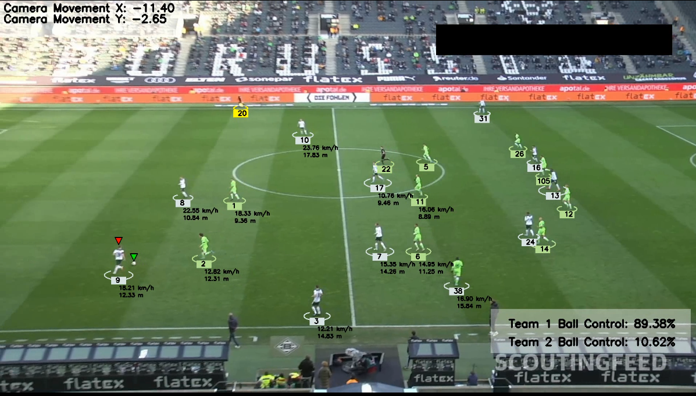

# AI-ML-Football-Analysis-System

## Description

This project uses AI and machine learning techniques to analyze football games. It works with YOLO for object detection, OpenCV for video processing, and Python as the programming backbone. The system tracks players on the field, calculates their speed, distance covered, and also tracks ball control percentages for both teams. This can be useful for understanding player performance, team strategies, and overall match dynamics.

## Modules Used 
-**YOLO**: For real-time object detection of players.
-**OpenCV**: For processing video footage and extracting key frames.
-**Python**: The main programming language used to implement the system.
-**NumPy**: For numerical operations and data manipulation.
-**Pandas**: For organizing and processing tabular data.
-**Matplotlib**: For visualizing the data and generating plots.
-**TensorFlow**: If you're retraining or fine-tuning the model.

## Training Models

-[Link to Modules](https://drive.google.com/file/d/1FSucb8Jj01alwZ9WoOPpNiT7erbK2Vld/view?usp=sharing)

## Sample Video

-[Link to Video](https://drive.google.com/file/d/164s_5Ba1_W_wboYO7IHgTcsljj8IWBG1/view?usp=sharing)

## Requirements

To run this project, you need to have the following requirements installed:

-Python 3.x
-ultralytics
-supervision
-OpenCV
-NumPy
-Matplotlib
-Pandas